# Welcome Tattoo Studio Front 

<details>
  <summary>Contenido 📝</summary>
  <ol>
    <li><a href="#objetivo-🎯">Objetivo</a></li>
    <li><a href="#sobre-el-proyecto-🔎">Sobre el proyecto</a></li>
    <li><a href="#stack">Stack</a></li>
    <li><a href="#deploy-🚀">Deploy</a></li>
    <li><a href="#instalación-en-local">Instalación</a></li>
    <li><a href="#vistas">Vistas</a></li>
    <li><a href="#futuras-funcionalidades">Futuras funcionalidades</a></li>
    <li><a href="#agradecimientos">Agradecimientos</a></li>
    <li><a href="#contacto">Contacto</a></li>
  </ol>
</details>

## Objetivo 🎯

Vincular una API a la parte frontal de una web usando los conocimientos adquiridos en clase. (lo demas si esoooo... a tomar porculo) para dotar a la pagina de una base de datos que permita al usuario registrase y establecer una cita  


## Sobre el proyecto 🔎   

Esta aplicación está creada para agilizar el registro y gestión de citas de los usuarios de un estudio de tatuajes. Para ello he vinculado el proyecto con una base de datos que creé anterior mente y que podrá usar aquí https://github.com/AbrahamGalvezV/Tattoo_Studio_Backend . Para realizar esta parte frontal he usado las siguientes tecnologías.

## Stack 🛠️
<div align="center">
<a href="https://www.reactjs.com/">
    
</a>
<a href="https://developer.mozilla.org/es/docs/Web/JavaScript">
    
</a>
 </div>
 <div align="center">
  <a href="https://redux.js.org/" target="_blank">
    
  </a>
</div>
<div align="center">
  <a href="https://developer.mozilla.org/en-US/docs/Web/HTML" target="_blank">
    
  </a>
</div>
<div align="center">
  <a href="https://developer.mozilla.org/en-US/docs/Web/CSS" target="_blank">
    
  </a>
</div>
  
## Deploy 🚀
<div align="center">
    <a href="https://abrahamgalvezv.github.io/TATTOO_STUDIO_FRONT/"><strong>Pincha aquí </strong></a>🚀🚀🚀
</div>

## Instalación en local
1. Clonar el repositorio
2. ` $ npm install `
3. ``` $ npm run dev ```
4. Puedes usar este back
https://github.com/AbrahamGalvezV/Tattoo_Studio_Backend

## Vistas

#### Home

En esta vista encontramos los componentes header, body y footer establecidos en app.jsx y que nos acompañarán en todas las vistas de la página

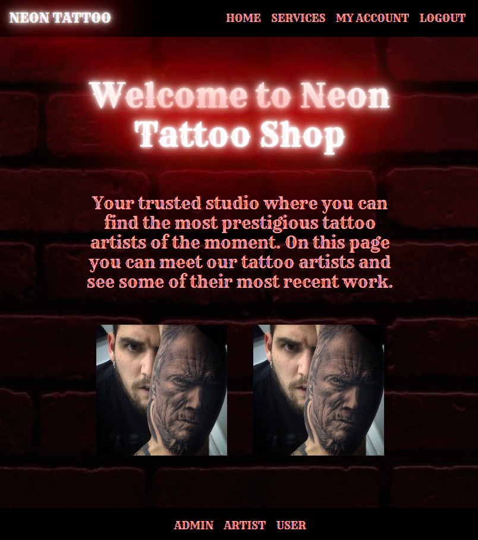

###### Header

Aquí encontramos el enlace a las distintas vistas de la página. NEON TATTOO también actúa como un botón que te conduce a la vista home

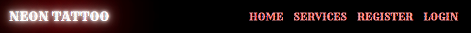

Al loguearte, login cambia por my account y login por logout

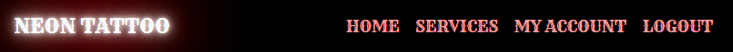

###### Body

En body encontramos un texto de bienvenida y otro descriptivo del estudio, justo debajo encontramos unas imágenes que cambian al situar el pulso encima creando un efecto neón alrededor y actúan como enlace a la página personal de dos de los artistas

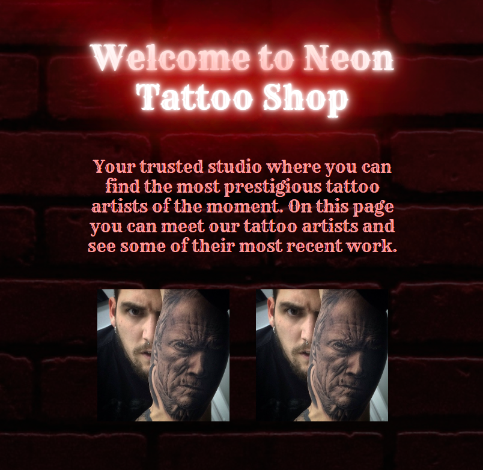

###### Footer

Aquí encontramos los tres roles con los que podemos acceder a la página, al presionar en uno de ellos nos llevará a la vista my account del rol seleccionado desde donde podremos comprobar los accesos y funciones que tiene cada role dentro de la página sin necesidad de logear.

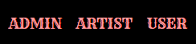

#### Services

Aquí encontramos una descripción de las distintas disciplinas que se llevan a cabo en NEON TATTOO junto a una imágenes-enlaces de los profesionales que las imparten

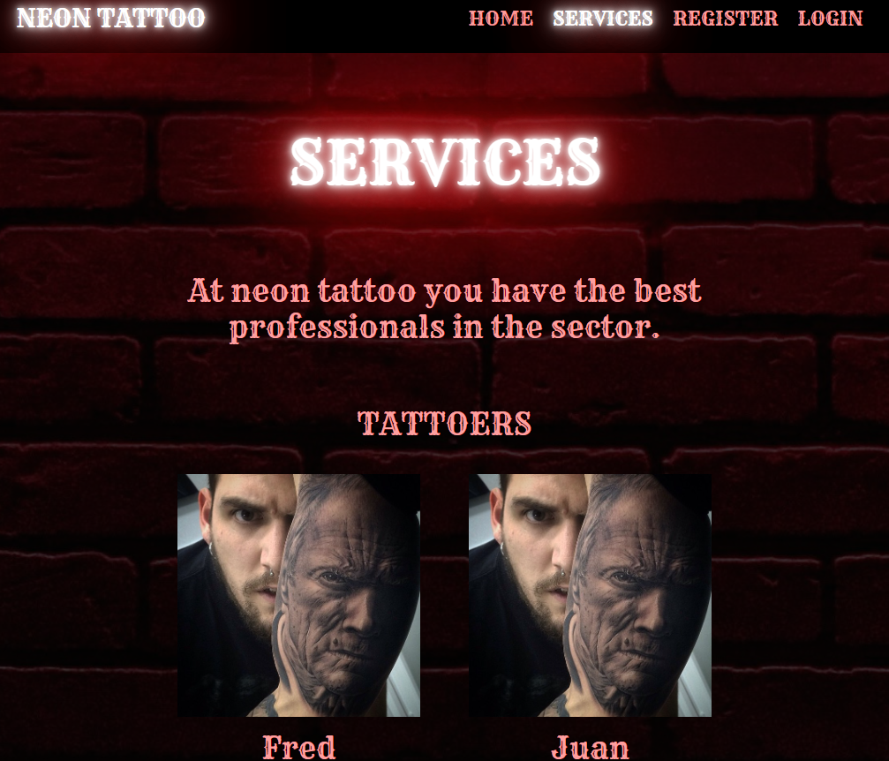

#### Register

Desde aquí podrá registrarse un nuevo usuario

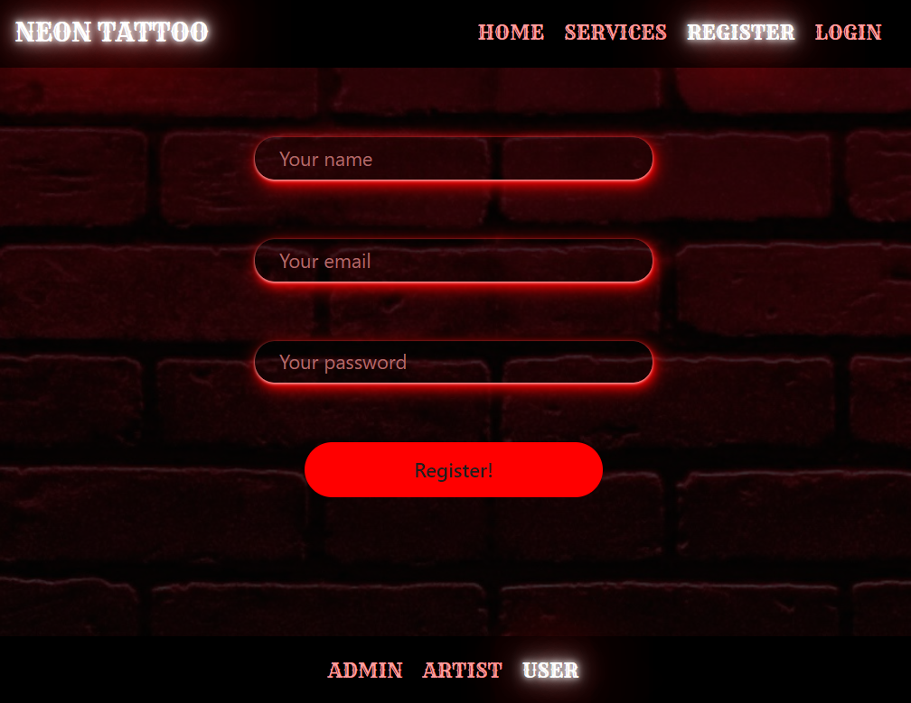

#### Login

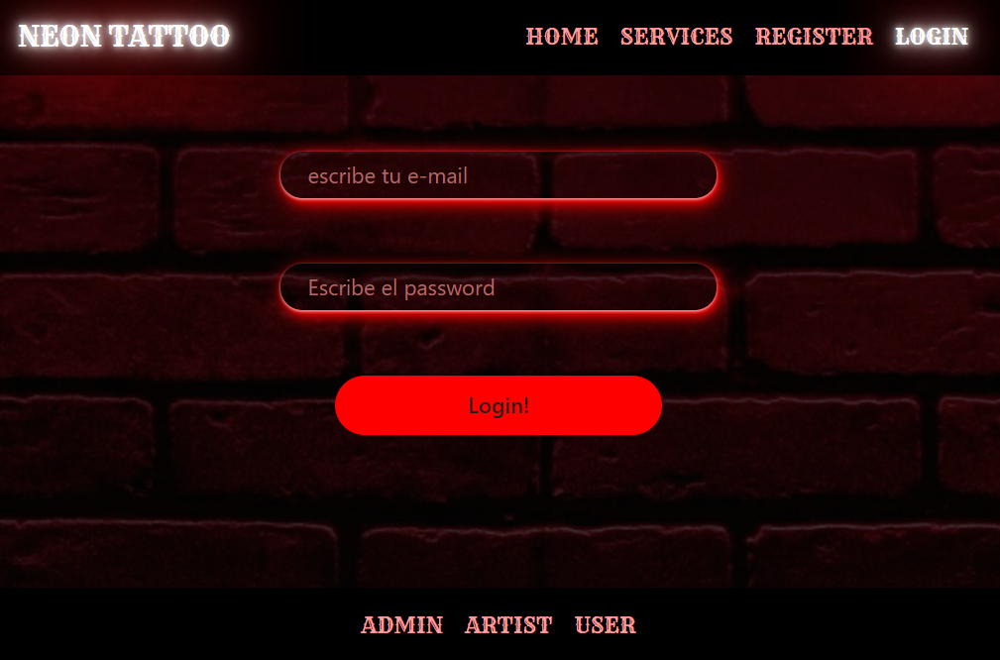

#### My Account

En esta vista encontramos los botones que te mostrarán la información a la que tienes acceso según el rol de la cuenta con la que accedas. El texto mostrará tu nombre de usuario

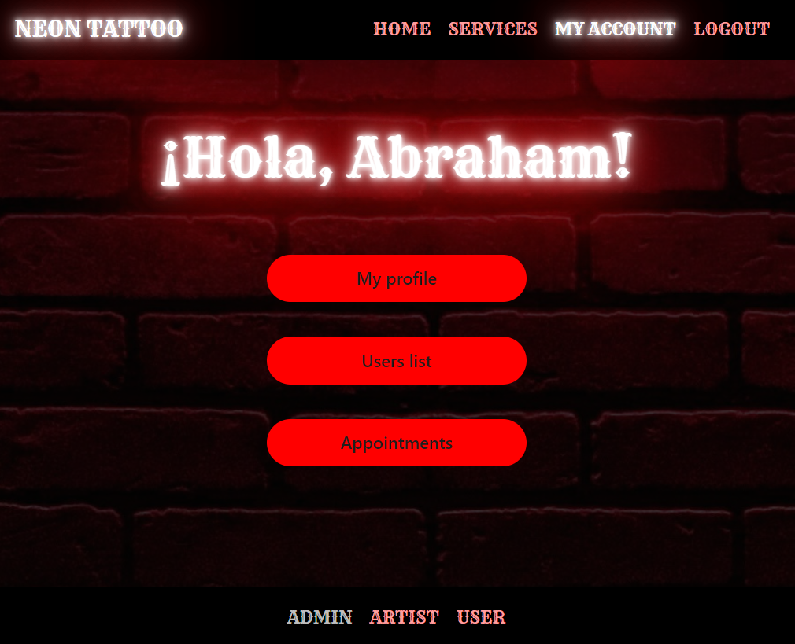

#### Edit profile

Desde aquí podremos modificar la toda la información de nuestro perfil. Al pulsar en "Edit profile" se desplegará un modal en el que podremos realizar los cambios

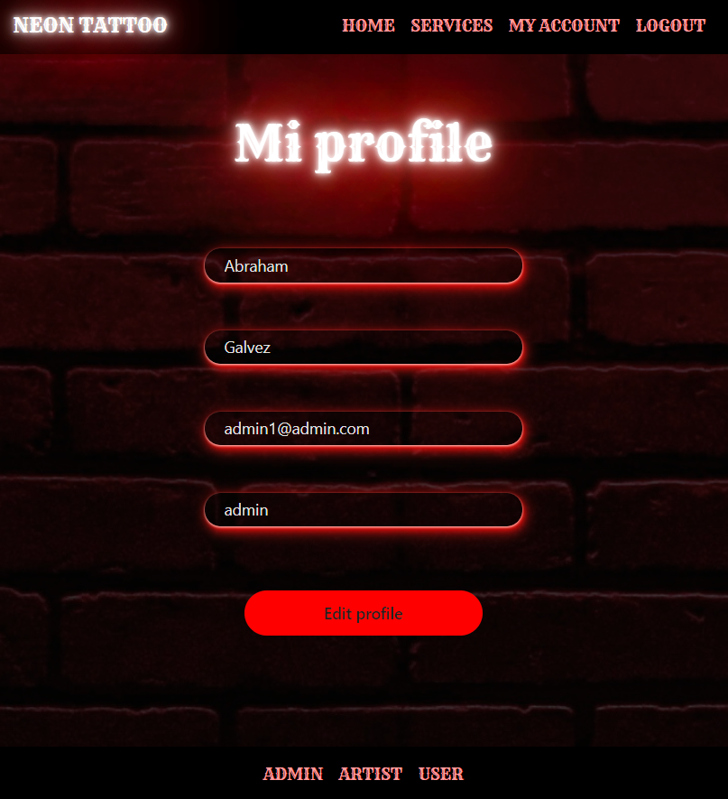

#### Users info

A esta vista solo puede acceder el administrador, desde aquí podrá buscar y eliminar usuarios


#### Citas

La información de esta vista cambiará dependiendo del rol con el que accedas. El administrador podrá ver todas las citas y crear nuevas mientras que artist y user solo podrán ver y borrar sus citas

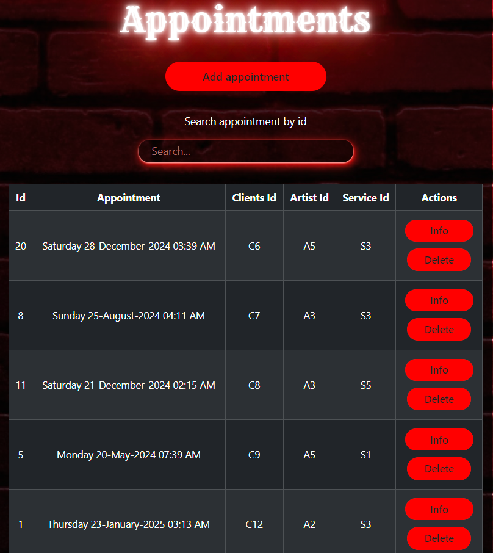

#### Pagina de los artistas del estudio

Cada artista tendrán su página donde se expondrán sus trabajos y habilidades

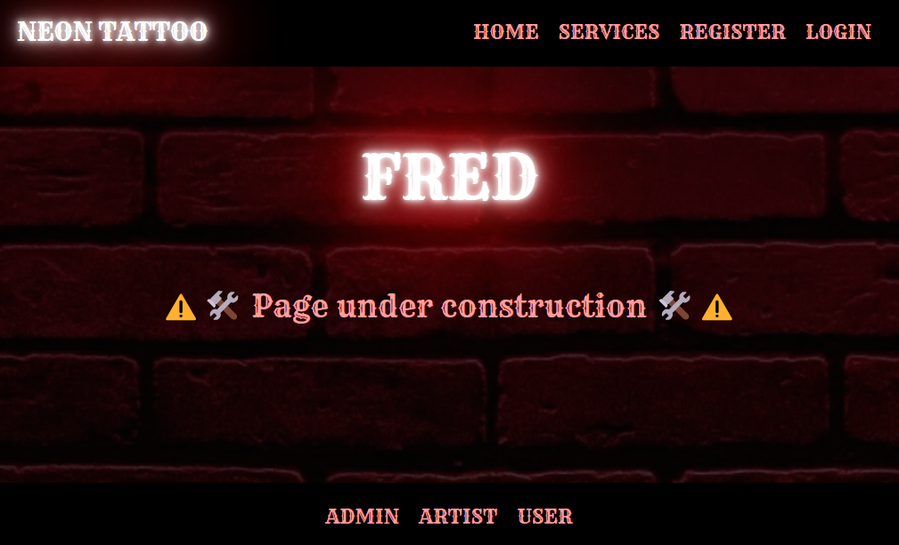

## Futuras funcionalidades
⬜ Crear un sistema en el que el artista confirme la cita establecida por el cliente.
 
⬜  Otorgar al administrador la posibilidad de cambiar los colores de letras y botones.

## Agradecimientos:

<a href="https://geekshubsacademy.com/" target="_blank">
  
</a>


## Contacto

<a href="mailto:abraham.galvez.vives@gmail.com">
  
</a>
<a href="https://www.linkedin.com/in/abraham-g%C3%A0lvez-vives-952aa32b2/" target="_blank"></a> 
</p>